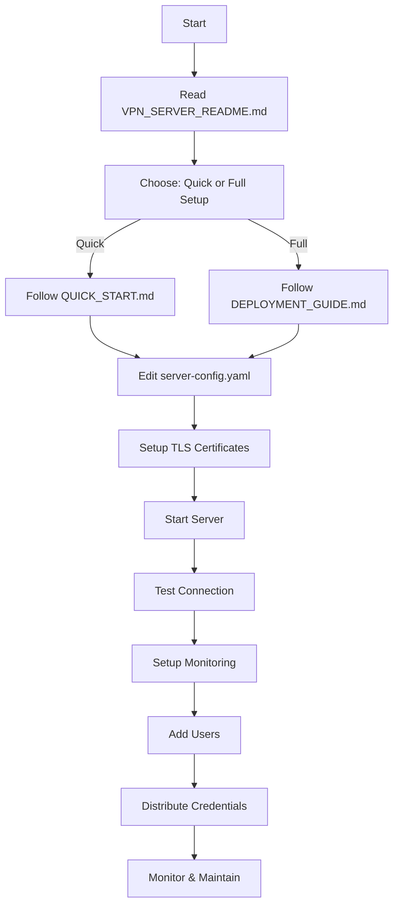

# 📚 Complete Documentation Index for Hysteria 2 VPN Server (20-30 Users)

This index helps you navigate all the documentation and configuration files for setting up and managing a Hysteria 2 VPN server for 20-30 users.

## 🚀 Getting Started

**Start here if you're new:**

1. **[VPN_SERVER_README.md](VPN_SERVER_README.md)** - Overview of the VPN server setup
2. **[QUICK_START.md](QUICK_START.md)** - Get your server running in 10 minutes
3. **[DEPLOYMENT_GUIDE.md](DEPLOYMENT_GUIDE.md)** - Comprehensive deployment guide

## 📋 Configuration Files

### Server Configuration
- **[server-config.yaml](server-config.yaml)** - Production-ready server configuration
  - Pre-configured for 30 users
  - Optimized QUIC settings
  - Bandwidth management
  - Obfuscation enabled
  - Traffic statistics API

### Deployment Options
- **[docker-compose.yml](docker-compose.yml)** - Docker Compose configuration
- **[hysteria-server.service](hysteria-server.service)** - Systemd service file

## 🛠️ Management Tools

### Scripts
- **[manage-users.sh](manage-users.sh)** - User management script
  - Add users
  - Remove users
  - Change passwords
  - List users
  - Backup configuration

- **[monitor.py](monitor.py)** - Server monitoring script
  - Real-time traffic statistics
  - System resource monitoring
  - Per-user bandwidth tracking
  - Connection status

## 📖 Documentation

### Setup & Deployment
1. **[QUICK_START.md](QUICK_START.md)** - 10-minute setup guide
   - Installation methods
   - Basic configuration
   - Certificate setup
   - First connection test

2. **[DEPLOYMENT_GUIDE.md](DEPLOYMENT_GUIDE.md)** - Complete guide
   - Server requirements
   - Installation methods
   - Configuration details
   - Certificate management
   - Running the server
   - Monitoring setup
   - Troubleshooting
   - Security best practices
   - Performance tuning
   - Maintenance schedule

### Architecture & Planning
3. **[NETWORK_ARCHITECTURE.md](NETWORK_ARCHITECTURE.md)** - Network design
   - Network topology
   - Server specifications
   - Bandwidth planning
   - Port configuration
   - Firewall rules
   - Security architecture
   - Load distribution
   - Monitoring architecture
   - Disaster recovery
   - Cost analysis
   - Performance optimization
   - Geographic considerations

### User Management
4. **[USER_CREDENTIALS_TEMPLATE.md](USER_CREDENTIALS_TEMPLATE.md)** - User credential template
   - Server information
   - Client configuration
   - Mobile setup
   - Troubleshooting
   - Security reminders
   - Acceptable use policy

### Reference
5. **[FAQ.md](FAQ.md)** - Frequently asked questions
   - General questions
   - Installation & setup
   - Configuration
   - Security
   - Performance
   - Troubleshooting
   - Monitoring & management
   - Costs & scaling
   - Advanced topics
   - Client configuration
   - Compliance & legal

6. **[PROTOCOL.md](PROTOCOL.md)** - Hysteria 2 protocol specification
   - Protocol details
   - Authentication
   - Proxy requests
   - Congestion control
   - Obfuscation

## 🗂️ File Organization

```
hysteria/
├── 📄 Configuration Files
│   ├── server-config.yaml              # Main server configuration
│   ├── docker-compose.yml              # Docker deployment
│   └── hysteria-server.service         # Systemd service
│
├── 🛠️ Management Scripts
│   ├── manage-users.sh                 # User management
│   └── monitor.py                      # Server monitoring
│
├── 📖 Documentation
│   ├── VPN_SERVER_README.md            # Main overview
│   ├── QUICK_START.md                  # Fast setup guide
│   ├── DEPLOYMENT_GUIDE.md             # Complete guide
│   ├── NETWORK_ARCHITECTURE.md         # Architecture guide
│   ├── USER_CREDENTIALS_TEMPLATE.md    # User credentials
│   ├── FAQ.md                          # FAQ
│   ├── PROTOCOL.md                     # Protocol spec
│   └── INDEX.md                        # This file
│
└── 🔧 Original Files
    ├── README.md                       # Hysteria project README
    ├── app/                            # Application code
    ├── core/                           # Core library
    ├── extras/                         # Extra modules
    └── scripts/                        # Install scripts
```

## 📊 Quick Reference

### Common Tasks

| Task | Command/File |
|------|--------------|
| **Install Server** | `bash <(curl -fsSL https://get.hy2.sh/)` |
| **Configure** | Edit `/etc/hysteria/config.yaml` |
| **Start Server** | `systemctl start hysteria-server` |
| **Add User** | `./manage-users.sh add username` |
| **Remove User** | `./manage-users.sh remove username` |
| **Monitor** | `./monitor.py -w` |
| **View Logs** | `journalctl -u hysteria-server -f` |
| **Backup Config** | `./manage-users.sh backup` |

### Important Configuration Sections

| Section | File | Purpose |
|---------|------|---------|
| **Listen Port** | server-config.yaml | Port server listens on |
| **TLS Certificates** | server-config.yaml | SSL/TLS configuration |
| **User Authentication** | server-config.yaml | User credentials |
| **Bandwidth Limits** | server-config.yaml | Traffic limits |
| **Obfuscation** | server-config.yaml | Censorship resistance |
| **Traffic Stats** | server-config.yaml | Monitoring API |

### Documentation by Use Case

#### 🆕 First Time Setup
1. Read [VPN_SERVER_README.md](VPN_SERVER_README.md)
2. Follow [QUICK_START.md](QUICK_START.md)
3. Review [server-config.yaml](server-config.yaml)

#### 🏢 Production Deployment
1. Study [NETWORK_ARCHITECTURE.md](NETWORK_ARCHITECTURE.md)
2. Follow [DEPLOYMENT_GUIDE.md](DEPLOYMENT_GUIDE.md)
3. Implement security from [DEPLOYMENT_GUIDE.md#security-best-practices](DEPLOYMENT_GUIDE.md)
4. Setup monitoring with [monitor.py](monitor.py)

#### 👥 User Management
1. Use [manage-users.sh](manage-users.sh) for operations
2. Distribute credentials with [USER_CREDENTIALS_TEMPLATE.md](USER_CREDENTIALS_TEMPLATE.md)
3. Monitor usage with [monitor.py](monitor.py)

#### 🔧 Troubleshooting
1. Check [FAQ.md](FAQ.md) first
2. Review [DEPLOYMENT_GUIDE.md#troubleshooting](DEPLOYMENT_GUIDE.md)
3. Examine logs: `journalctl -u hysteria-server -n 100`

#### 📈 Scaling Beyond 30 Users
1. Review [NETWORK_ARCHITECTURE.md#scalability-path](NETWORK_ARCHITECTURE.md)
2. Consider load balancing options
3. Plan for geographic distribution

## 🎯 Deployment Workflow

### Complete Setup Process



### Daily Operations

```
Morning:
1. Check server status: systemctl status hysteria-server
2. Review logs: journalctl -u hysteria-server -p err --since today
3. Check monitoring: ./monitor.py

As Needed:
4. Add/remove users: ./manage-users.sh
5. Update configuration: Edit server-config.yaml
6. Restart if needed: systemctl restart hysteria-server

Weekly:
7. Check for updates
8. Review traffic statistics
9. Backup configuration: ./manage-users.sh backup
```

## 🔗 External Resources

- **Official Website**: https://v2.hysteria.network/
- **GitHub Repository**: https://github.com/apernet/hysteria
- **Community Telegram**: https://t.me/hysteria_github
- **Issue Tracker**: https://github.com/apernet/hysteria/issues
- **Client Downloads**: https://v2.hysteria.network/docs/getting-started/Installation/

## 📞 Support Channels

### For This Setup
- **Configuration Issues**: Check [FAQ.md](FAQ.md)
- **Deployment Problems**: Review [DEPLOYMENT_GUIDE.md](DEPLOYMENT_GUIDE.md)
- **User Management**: See [manage-users.sh](manage-users.sh) help

### For Hysteria Software
- **Bugs**: GitHub Issues
- **Questions**: Telegram Group
- **Documentation**: Official Website

## 📝 Version Information

- **Hysteria Version**: 2.x (latest)
- **Configuration Version**: 1.0
- **Documentation Created**: 2026-01-31
- **Target Capacity**: 20-30 concurrent users

## ✅ Setup Checklist

Use this checklist to ensure you've completed all setup steps:

- [ ] Read VPN_SERVER_README.md
- [ ] Followed QUICK_START.md or DEPLOYMENT_GUIDE.md
- [ ] Edited server-config.yaml with custom passwords
- [ ] Setup TLS certificates
- [ ] Configured firewall rules
- [ ] Started and tested server
- [ ] Added user accounts
- [ ] Tested client connection
- [ ] Setup monitoring (monitor.py)
- [ ] Configured backups
- [ ] Documented custom settings
- [ ] Distributed credentials to users
- [ ] Established maintenance schedule

## 🎓 Learning Path

### Beginner
1. **Start**: [VPN_SERVER_README.md](VPN_SERVER_README.md)
2. **Deploy**: [QUICK_START.md](QUICK_START.md)
3. **Manage**: [manage-users.sh](manage-users.sh)

### Intermediate
1. **Optimize**: [DEPLOYMENT_GUIDE.md#performance-tuning](DEPLOYMENT_GUIDE.md)
2. **Monitor**: [monitor.py](monitor.py)
3. **Secure**: [DEPLOYMENT_GUIDE.md#security-best-practices](DEPLOYMENT_GUIDE.md)

### Advanced
1. **Architect**: [NETWORK_ARCHITECTURE.md](NETWORK_ARCHITECTURE.md)
2. **Scale**: [NETWORK_ARCHITECTURE.md#scalability-path](NETWORK_ARCHITECTURE.md)
3. **Customize**: [PROTOCOL.md](PROTOCOL.md)

## 📊 Feature Matrix

| Feature | Configured | File/Section |
|---------|-----------|--------------|
| **User Authentication** | ✅ Yes | server-config.yaml (30 users) |
| **Bandwidth Management** | ✅ Yes | server-config.yaml |
| **Obfuscation** | ✅ Yes | server-config.yaml (Salamander) |
| **Traffic Statistics** | ✅ Yes | server-config.yaml + monitor.py |
| **TLS Encryption** | ✅ Yes | server-config.yaml |
| **UDP Support** | ✅ Yes | server-config.yaml |
| **HTTP/3 Masquerading** | ✅ Yes | server-config.yaml |
| **User Management** | ✅ Yes | manage-users.sh |
| **Monitoring** | ✅ Yes | monitor.py |
| **Docker Support** | ✅ Yes | docker-compose.yml |
| **Systemd Service** | ✅ Yes | hysteria-server.service |
| **Documentation** | ✅ Yes | Multiple .md files |

## 🎉 You're All Set!

You now have everything you need to:
- ✅ Deploy a Hysteria 2 VPN server
- ✅ Support 20-30 users efficiently
- ✅ Manage users easily
- ✅ Monitor performance
- ✅ Maintain security
- ✅ Scale when needed

**Start with**: [QUICK_START.md](QUICK_START.md) for immediate deployment!

---

**Questions?** Check [FAQ.md](FAQ.md) or reach out to the community!
